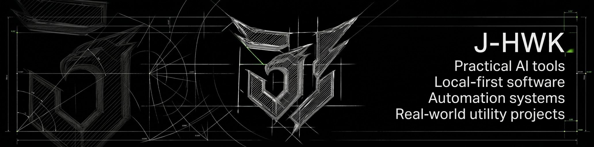

  

# J-HWK

### Practical AI tools • Local-first software • Automation systems • Operational software • Awareness-focused concepts

 

---

## Overview

I build and explore practical systems designed for real use.

My direction is centered around AI-assisted tools, local-first software, automation workflows, operational dashboards, and utility-driven systems built to improve clarity, speed, coordination, and execution.

I am especially interested in software that supports real workflows and real environments rather than existing only as a concept or short-lived prototype.

---

## What this profile represents

This profile represents a builder mindset focused on:

- practical software thinking
- utility-first product logic
- structured workflows
- clear interfaces
- local-first and private software where appropriate
- systems designed to reduce friction and improve execution

The goal is to build software that is useful, intentional, and worth keeping.

---

## Strategic Build Areas

| AI & Automation | Operational Software | Field & Awareness Systems |
|---|---|---|
| Practical AI tools | Workflow-oriented platforms | Awareness-focused concepts |
| Decision-support utilities | Structured dashboards | Coordination and visibility tools |
| Local-first utility apps | Information flow systems | Mission-support interfaces |
| Automation-first tools | Execution-focused software | Real-world field software ideas |

---

## Core Focus

- AI-powered tools
- Local-first and private software
- Automation systems and workflow design
- Operational dashboards and control panels
- Productivity and decision-support tools
- Awareness-oriented software concepts
- Real-world utility applications

---

## Future Systems I Want to Build

Over time, I want to move toward software and system categories such as:

- operational and awareness platforms
- support systems for demanding workflows
- drone-related software concepts
- AI-assisted workflow tools
- local-first utility systems
- structured software for field and operational use

---

## Operational Software Themes

The themes that consistently shape my direction include:

- situational awareness
- operational visibility
- structured decision support
- workflow reduction
- information flow
- dashboard clarity
- monitoring and coordination
- field usability
- action-oriented interfaces

---

## System Traits I Value

The system traits I value most are:

- clear structure
- strong usability
- low-friction workflows
- fast access to relevant information
- controlled complexity
- practical outputs
- modular logic
- reduced noise
- reliable system behavior

A system should not just contain features.  
It should make action easier, information clearer, and execution more reliable.

---

## Current Direction

At the moment, my direction is centered on exploring and refining systems around:

- practical AI applications
- local-first utility software
- workflow automation
- structured operational dashboards
- awareness-oriented software concepts
- real-world software ideas with long-term utility

---

## Selected Projects

> This section includes planned project directions and future repository ideas.

| Project | Description | Status |
|---|---|---|
| Situation Awareness Platform | Awareness and visibility-focused software concept. | Planned |
| Medical and Firefighter Support System | Support-oriented software concept for demanding workflows. | Planned |
| Drone Detection System | Detection and monitoring-focused software concept. | Planned |
| Drone Support Platform | Drone-related operational software concept. | Planned |
| Local-First Operational Dashboard | Private dashboard concept for structured workflows. | Planned |
| AI Workflow Utility Suite | Practical AI and automation-oriented toolset. | Planned |

---

## Working Principles

- Utility over hype
- Clear structure over clutter
- Real workflows over gimmicks
- Speed over unnecessary complexity
- Privacy and local control where possible
- Systems built to be used, not just shown

---

## Build Approach

When I work on a project, I prefer to think in systems.

That means I focus on:
- the real use case first
- the clarity of the interface
- how information moves through the workflow
- what should be visible
- what should be automated
- what should stay local or private
- how the final tool improves real execution

The goal is not only to make something functional.

The goal is to make it usable, efficient, structured, and worth keeping.

---

## Philosophy

> Build useful.  
> Keep it sharp.  
> Keep it practical.
